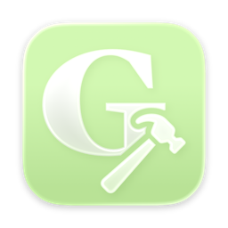
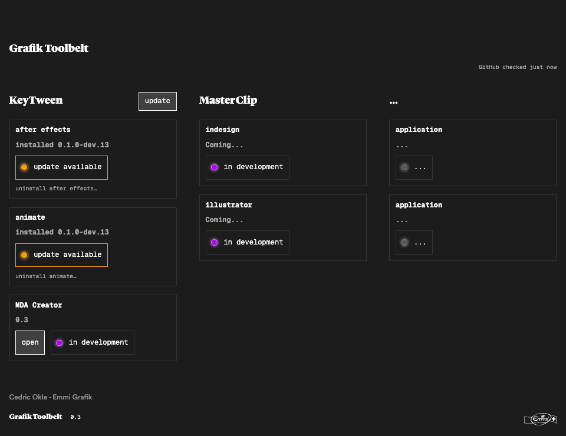

<h1 align="center">Grafik Toolbelt</h1>

A home for custom creative apps and Adobe plugins.

<a href="https://github.com/oklepunkt/Grafik-Toolbelt-Releases/releases/latest"><strong>Download the latest version for macOS</strong></a>

Grafik Toolbelt brings installation, updates and standalone creative tools into one compact macOS app. Install your plugins, check for new versions, and open the tools you need from the same place.

| Tool | What it does | Availability |
| --- | --- | --- |
| **KeyTween** | Transfers supported After Effects animation and artwork into editable Adobe Animate content. | Development preview for After Effects and Animate |
| **MDA Creator** | A dedicated workspace for mobile display-ad projects. Opens in its own window. | Interface preview; project automation is in development |
| **MasterClip** | Planned tools for InDesign and Illustrator. | In development |

### Get started

1. Open the **[latest release](https://github.com/oklepunkt/Grafik-Toolbelt-Releases/releases/latest)** and download the `.dmg` file.
2. Open the DMG and drag **Grafik Toolbelt** into **Applications**.
3. Open Toolbelt. Use **Grafik Toolbelt → Check for Updates**, or **open** to launch MDA Creator.
4. To try KeyTween, select installer storage when prompted and quit both Adobe apps before installing their panels.

**Requirements:** macOS 13+, Apple Silicon or Intel. The current KeyTween preview targets After Effects 26.x and Animate 24.x with CEP 12.

### Updates

Toolbelt reads releases from this public repository—no GitHub account or access token is needed. Plugin downloads are checked before installation; recovery copies remain in your selected Working Folder. Toolbelt app updates download and open a verified DMG; quit the app and replace it in Applications to finish.

Development plugin releases are included by default. Installed versions are never automatically downgraded. Update checks run automatically every 30 minutes while Toolbelt is open and never replace running Adobe panels. Releases contain only the DMG and GitHub’s automatic source archives. Plugin updates are read from the verified DMG.

KeyTween has one shared update button beside its heading. Installations start directly and offer Cancel while in progress; cancellation restores the previous installation. Uninstall uses an in-app confirmation.

The interface starts at 120% size. Use the View menu to change its size; your choice is remembered. Upgrading from the old 0.2.1-numbered app to 0.2 requires a manual DMG download once.

### Preview status

The current release is **ad-hoc signed and not Apple-notarized**, so macOS may block first launch. Native app and Adobe-host testing are still pending for the latest build. MDA Creator's project controls and MasterClip are previews.

This repository contains **downloads, release notes and public documentation only**. Source development is maintained separately. Release versions are immutable: corrections receive a new version.

— Cedric Okle · Emmi Grafik
